Getting Started
===============

After you have sucessfully installed Quito on your server before starting quito its important to follow the documentating below on setting up the service

Setup installation
-------------------
After you have succesfully installed Quito please follow the steps below to get it working securely and at its optimal capacity.

- The first file that you will need to edit is the ***docker-compose.yml*** file. 
	1. To enable the nginx server to manage the services ucomment the block for the nginx proxy as shown.
  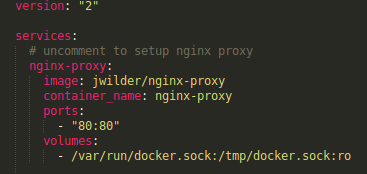

  2. You need to now allow the nginx server to take priority on start up so you need to uncomment the depends on nginx code for **"quito"** and **"app"** service(Please take note of the indentation with the other lines of code to reduce errors).
     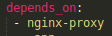

  3. Remove the port mapping for quito.core 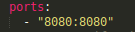and web services 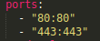

***Please note you would need to setup the server hosting for nginx on your server***

-------------

- Enter the **env** directory and remove all the files with the extention (.sample).
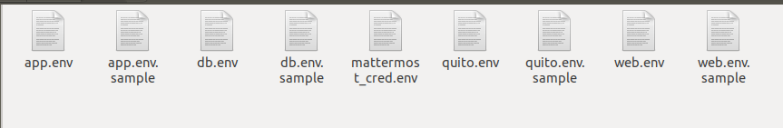

  1. Open the **app.env** file amd chnage the MM_username, password and Dbname to something more secure

  2. Open the **db.env** files and ensure you set the the POSTGRES_USER, password and db as the same names as in the **app.env** file

  3. Open the **quito.env** file and uncoment the line for the virtual host and port and chnage the mattermost host to the hosting location for mattermost(This is very crucial so that plone can integrate with mattermost)
  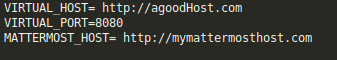

  4. Open the **web.env** file uncomment and set the virtualhost to the url for the mattermost site. 
  ```
  VIRTUAL_HOST=http://mymattermosthost.com
  ```

***All virtaul host should be setup in the server hosting settings***
 
 -----------------
- Finally, now you can start the serice by running
  ```
  Linux
  ./start.sh

  Windows
  start.bat
  ```
  To stop quito you may run
   ```
  Linux
  ./stop.sh

  Windows
  stop.bat
  ```


Setup Quito System
--------------------
Now that you have configured and started your quito system. There are just a few more steps remaining to get it up and running efficiently.

- After a successful start before visting the mattermost hosting url for your system. First visit the quito hosting url. You should meet a page like this. 

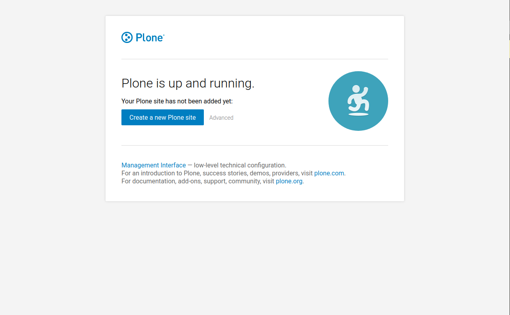

- Next you need to select advanxce. Then enter the name of your site and a title. your screen should look similar to below

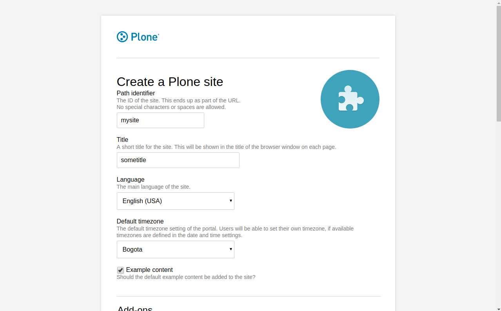

- You now need to scroll to the bottom of the screen and select plone.restapi and quito.core. It should look similar to the image and select create Plone site

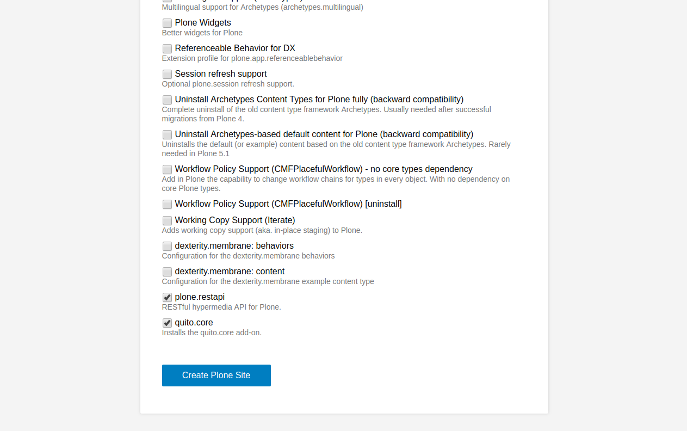

- On a successful start you should be greeted with a welcome screen

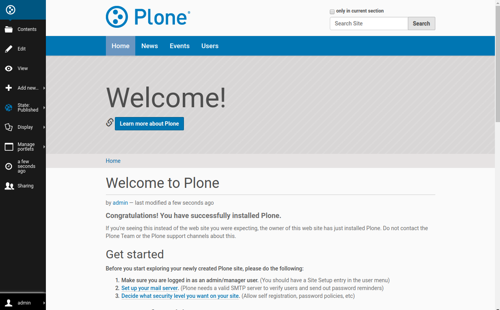

- Now visit the host for your mattermost site. It should look similar to below. Select create one now 

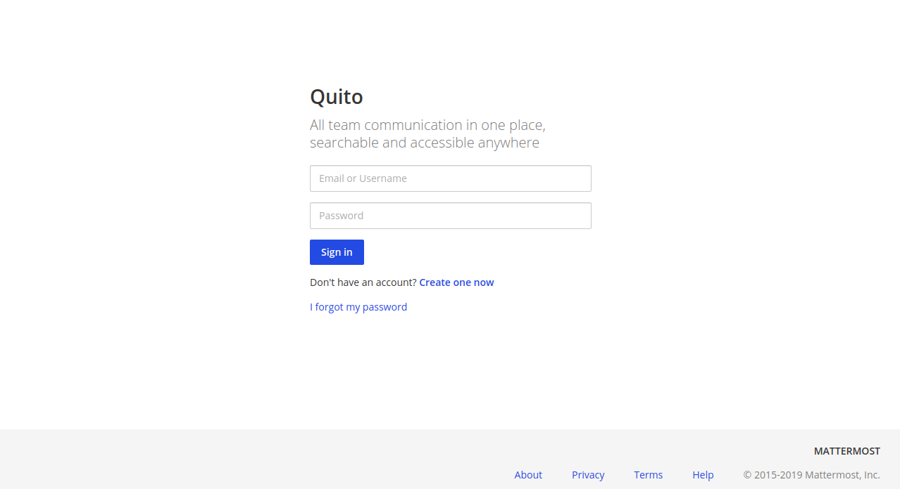

- On the sign up page enter your credentials then press create accout

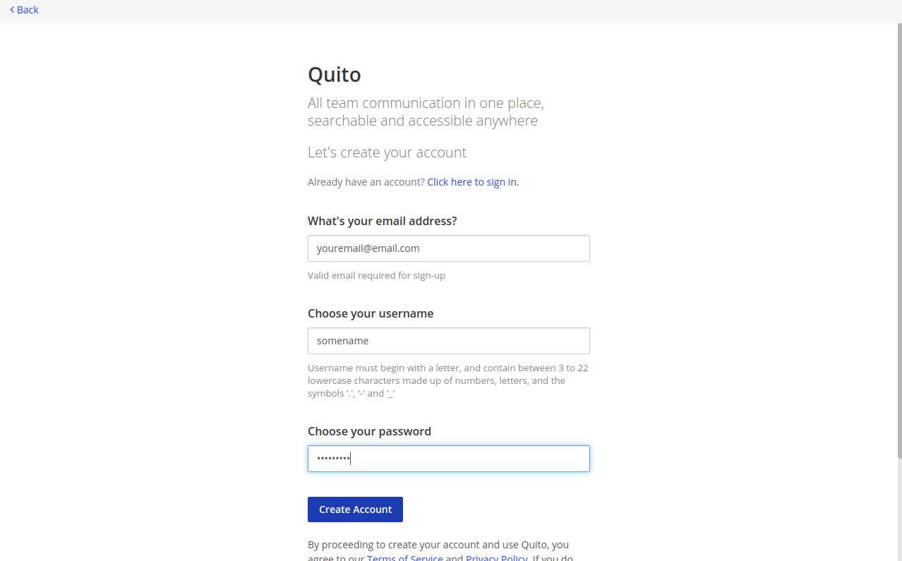

- On successuful account creation you should be pushed ti screen as below

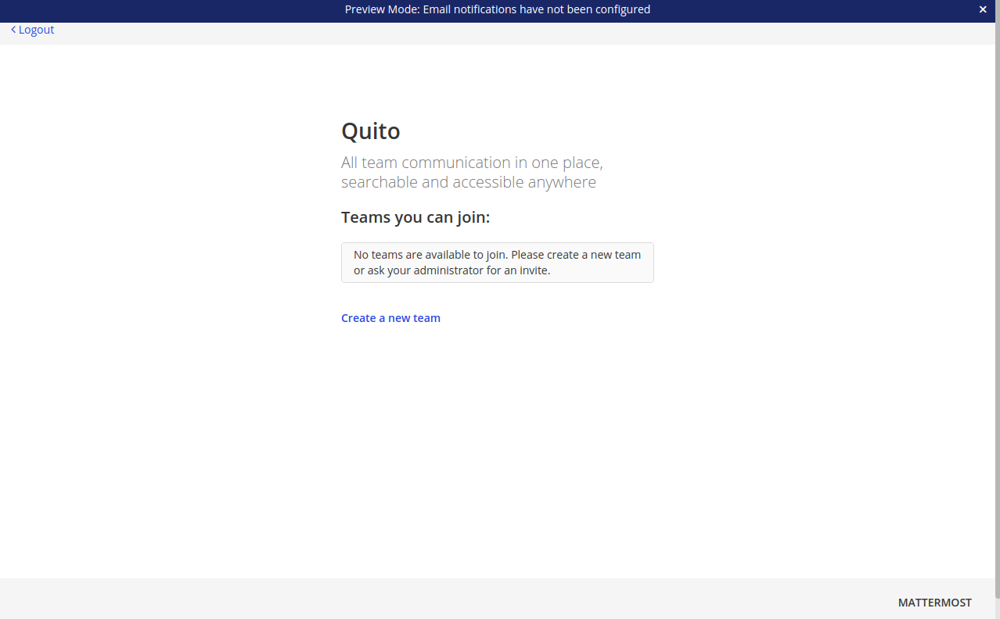

------------------

***Congratulations You have Completed the Setup with Quito Core***

