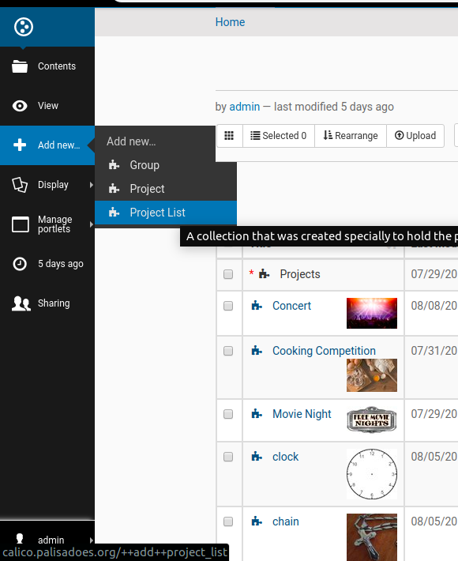
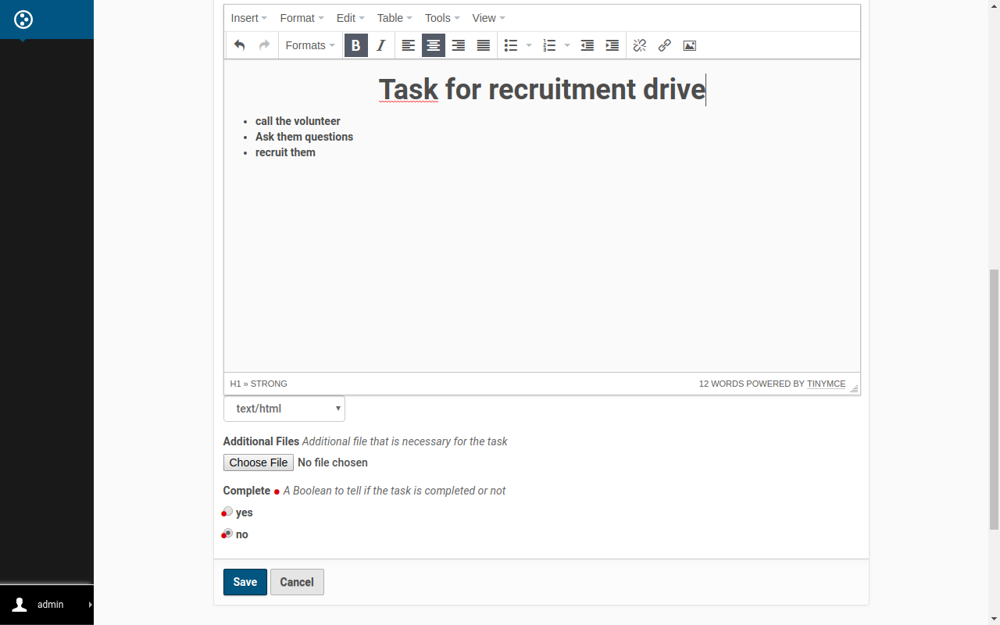

Guide on how to use Quito
==========================

This Guide consist of the documentation on how to manipulate the various functionailty that comes with Quito. 
It will cover all the data types and all the configuration on the site

Project List
-------------
- The project List is a container that which is used to sort a set of project base on the criteria that is set for the project. This criteria could include being in a folder, publish, unpublish for a specific date and more.

- No you cant have nested project list but you could have project list witht the criteria being set to another project list.  

##### Creation
- To create a new Project List you would first need to Login to your Plone site for Quito. After doing so you need to select content 

- In the root directory you can create a folder and enter the root of that folder or you could create the new project List in the root of your directory. For this tutorial a project list would be added to the root of the main directory. 

- On the left of the screen you would see the **add new button**. Press it and then select Project list as shown below.

- When you have done that you would be greeted with the form for the project List. Enter the name and summary.

- For the project list you would need to add the criteria for the contents that you would like to search for in the list. The main criteria that you must have is the criteria of **type = Project**. You may select the criterias as shown in the picture below. 

- When you are done you are able to write some html/ use the editor To show static content to describe the screen then press **Save**.

- Successful creation would lead you to the Project List display screen. 

- ***Congratulations you have created your project list***

##### Modification
- You need to Login to Plone first
- To modify your project List you first need to open into your project list 
- when your on its display screen like below you need to select **Edit** from the menu on the left

- After you should be greeted with the screen with the forms.

- Make your changes and after you have editted your project list press the **Save** button

- Your changes have been made and your project list editted.

##### Deltetion
*Warning this process is not reversable*
- You need to login to plone first 
- To delete your project you need enter into your project list. 
- In your project on the left side of the screen select the Actions button

- After you would see the option to **delete** select the option

- Finally you would need to confirm the delete (note this object would not be able to be retrieved after this).

Project
--------
- The Project is a content type which can be used to create a project or event. This project or event can have members and who are assigned to it, an image and the other factors to describe what that project is. 
- You can have nested projects, however, it is advice to reduce creating them
- A project can be a container to also a task , task list or a group
- A creation of a project in plone will prompt a creation of a channel in mattermost. The member of the project will be added to the channel if they are available. 

##### Creation
*For this tutorial we would create a project in the main directory*
- To start you first need to login into your Quito plone website.
- Afer Login on the left side of the screen select the Contents option.
- At this point you are able to change your directory to something of your liking.

- When you have selected your directory you need to select add new then Project

- You would be prompted with a screen to fill in the Project information.
- Enter the name of the project and a description
- Enter the *(username/fullname with space/ email)* for each member of the project
- Enter the start and End date for the event
-you could select an whole day event or open ended(without an end date)

- The contact infromation would be needed for the organizer of the project along with other information to define it as shown below.
- upload an image for the project 
- set the recurrance for the event if it would repeat

- Finally you should be able to enter additionaly information for your project in the Text field, you are able to use html or the editor to do it as well. 

- Now press save
- On successful creation of your new project, you should be greeted witht the project screen listing the information that you have inputted.

- If you are running quito with mattermost. A channel should also be created along with the project screen in plone detailing the same information that you have placed in.

***Congratulations you have created your Project***

##### Modification
- First you would need to login to your plone website
- After logging select and enter the project that you would like to edit.
- To the left of the screen you would see the option to edit, select that option.

- You would reach the screen to similar to when you were creating the project
- Make the changes that you need to make
- For the tutorial i changes the name of the project

- When you have made all your changes scroll to the bottom of your screen and select save.

- A successful edit would lead you to the Project display screen showing the information that was changed.

- If you have a mattermost server the necessary changes should aslo reflect on the mattermost server. 

##### Deltetion
*Warning this process is not reversable*
- First you would need to login to your plone website
- After logging select and enter the project that you would like to edit.
- On the left of the screen you would see the Action option
- Select the action option then press delete
- you would be asked to confirm your action, select delete once more to make your confirmation

- A successfull delete would cause the Project to be removed from the directory and also the channel for the project also removed from mattermost

Task
-----
- A task is a content type that can be used to describe a specific activity that should be done for a project. A task can have two states depending on if it is completed or not and members can be attached to a task
- A task can also only exist within a project or Task list. 

##### Creation

*For this tutorial the task would be created inside of a project called concert that was previously created*
- To start you first need to login into your Quito plone website.
- Afer Login on the left side of the screen select the add new option.
- Now select Task

- Next you will be sent to the task configuration screen
- Enter the name and description for the task
- Enter the *(username/fullname with space/ email)* for each member appointed to the task

- Enter the task Detail then save the task

- You should be sent to the screen showing the task information that you have created

***Congratulations you have created a task***

##### Modification

- First you would need to login to your plone website
- After logging select and enter into the task that you would like to edit.
- On the left of the screen select the **edit** option

- You will be sent to the screen to edit the information
- For this tutorial i will only edit name of the task
- Change the necessary informtion that you wiol like to change

- Finally, scroll to the bottom of the screen then press save

- on successful edit you should be sent to the Task screen with the information changed

##### Deltetion
*Warning this process is not reversable*
- First you would need to login to your plone website
- After logging select and enter into the task that you would like to edit.
- On the left of the screen select the **actions** option then press delete.

- It will then ask to confirmy your delete. Select delete to confirm your delete

Task List
----------
- A task list is a folder like object that can be used to group relating tasks together.
- A task list can only exist within a project

##### Creation
*For this tutorial the task list would be created inside of a project called concert that was previously created*
- To start you first need to login into your Quito plone website.
- Afer Login on the left side of the screen select the add new option.
- Now select *Task List*

- Next you will be sent to the task List configuration screen
- Enter the name and description for the task List
- Select save when finish

- You should be sent to the screen showing the task List information that you have created.
- It will also be empty until you add Tasks to the list

***Congratulations you have created a task***

##### Modification
- First you would need to login to your plone website
- After logging select and enter into the task List that you would like to edit.

- On the left of the screen select the **edit** option

- Make the changes that you would like. For this tutorial I only changed the name
- When you are done select save

- On successfull edit your changes should be saved and displayed on the Task List display

##### Deltetion
*Warning this process is not reversable*
- First you would need to login to your plone website
- After logging select and enter into the Task List that you would like to edit.
- On the left of the screen select the **actions** option then press delete.

- It will prompt you to confirm your delete. To do so press delte. 

Groups
------
- A group is an object to hold a list of members. 
- A group can be used to add or remove a list of members with similar interest to a project or task
- A group can only exist within a taks list or task

##### Creation
*For this tutorial the task list would be created inside of a project called concert that was previously created*
- To start you first need to login into your Quito plone website.
- Afer Login on the left side of the screen select the add new option.
- Now select *Group*

- Next you will be sent to the Group configuration screen
- Enter the name and description for the Group
- Enter the *(username/fullname with space/ email)* for each member apart of the group
- Select save when finish

- You should be sent to the screen showing the Group information that you have created.

##### Modification
- First you would need to login to your plone website
- After logging select and enter into the group that you would like to edit.
- On the left of the screen select the **edit** option

- Make the changes that you would like. For this tutorial I only changed the name
- When you are done select save

- On successfull edit your changes should be saved and displayed on the group's display

##### Deltetion
*Warning this process is not reversable*
- First you would need to login to your plone website
- After logging select and enter into the group that you would like to edit.
- On the left of the screen select the **actions** option then press delete.

- It will prompt you to confirm your delete. To do so press delte. 

